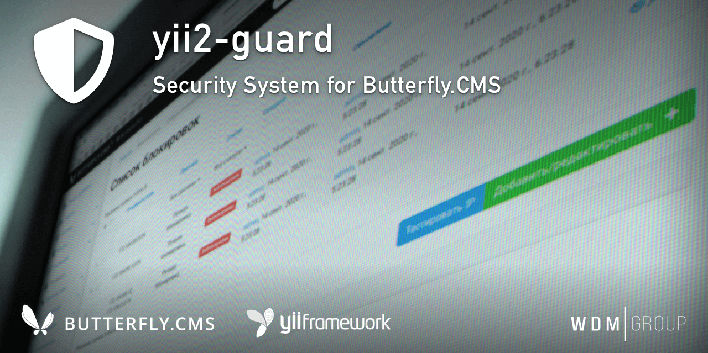

# Yii2 Guard
Security system for Yii2. The extension is able to detect and repel Overdrive attack, XSS attack, LFI / RFI / RCE attack, PHP / SQL injection attacks, and block by over rate limit.
As well as block the user by IP and network (possible to add blocking client manually).

This module is an integral part of the [Butterfly.СMS](https://butterflycms.com/) content management system, but can also be used as an standalone extension.

Copyrights (c) 2019-2020 [W.D.M.Group, Ukraine](https://wdmg.com.ua/)

# Requirements 
* PHP 5.6 or higher
* Yii2 v.2.0.35 and newest
* [Yii2 Base](https://github.com/wdmg/yii2-base) module (required)

# Installation
To install the module, run the following command in the console:

`$ composer require "wdmg/yii2-guard"`

# Configure
To add a module to the project, add the following data in your configuration file:

    'modules' => [
        ...
        'guard' => [
            'class' => 'wdmg\guard\Module',
            'routePrefix' => 'admin'
            'useFilters': true, // flag for use filters
            'filters': [ // flag for use request filters
                'xss': true,
                'lfi': true,
                'php': true,
                'sql': true
            ],
            'patterns': [ // security filters (regexp patterns)
                'xss': '/(<.*?(script|body|object|iframe|applet|meta|style|form|frameset|frame|svg).*?>)|(base64|data\\:|fromCharCode|expression|onmouse|onload|alert|getcookie|document\\.)/uim',
                'lfi': '/((\\.|%2e){2,}(\\/|%5c|\\\\)|php:\\/\\/|file:\\/\\/|expect:\\/\\/|zip:\\/\\/|yii\\.php|init\\.php|web\\.php|params\\.php|db\\.php|console\\.php|test\\.php|test_db\\.php|phpinfo|passwd|htaccess)/uism',
                'php': '/(php:\\/\\/|(eval|preg_replace|require|include|call_user|create_func|array_filter|array_reduce|array_walk|array_map|reflection)\\()/uism',
                'sql': '/(UNION|SELECT|OUTFILE|ALTER|INSERT|DROP|TRUNCATE|({%tables}))\\s/uism'
            ],
            'useRateLimit': true, // flag for use requests limitation
            'rateLimit': 60, // request limit`s per minute
            'rateLimitIgnoringIP': [ // ignoring by IP
                '::1',
                '127.0.0.1',
            ],
            'rateLimitIgnoringRoutes': [ // ignoring by request route
                '/admin'
            ],
            'rateLimitExceptionRoutes': [ // exception from ignoring by request route
                '/admin/login'
                '/admin/restore'
            ],
            'rateLimitIgnoringRequests': [ // ignoring by request type
                'post': false,
                'get': false,
                'ajax': true
            ],
            'rateLimitErrorMessage': 'Your request limit has been exceeded! Try later.', // request limit error message
            'useOverdriveLimit': true, // flag for use overdrive limitation
            'overdriveLimit': [ // limit for $_POST and $_GET data overdrive
                'post': 200,
                'get': 100
            ],
            'maxAttempts': 5, // maximum number of attack attempts before blocking
            'attemptsDuration': 3600, // time in seconds of storage the history of attempted attacks in the cache
            'releaseTime': 3600, // time in seconds of removal restrictions (time of blocking)
            'useIpRange': true, // use blocking also by a range of network IP addresses
            'forbiddenLayout': "@wdmg/guard/views/layouts/default" // use forbidden error layout for frontend
            'useFileSystemScan': true, // use a file system scan for modification
            'fileSystemScan': [ // file system scan options
                'scanInterval': 21600,
                'autoClear': true,
                'onlyTypes': [
                    '*.php',
                    '*.js'
                ],
                'exceptTypes': [],
                'excludesPath': [
                    '@runtime',
                    '@tests',
                    '@runtime/cache',
                    '@webroot/assets'
                ]
            ],
            'scanReport': [ // options for sending scan notifications by email
                'emailViewPath': [
                    'html': '@wdmg/guard/mail/report-html',
                    'text': '@wdmg/guard/mail/report-text'
                ],
                'reportEmail': 'admin@example.com'
            ]
        ],
        ...
    ],

# Routing
Use the `Module::dashboardNavItems()` method of the module to generate a navigation items list for NavBar, like this:

    <?php
        echo Nav::widget([
        'options' => ['class' => 'navbar-nav navbar-right'],
            'label' => 'Modules',
            'items' => [
                Yii::$app->getModule('guard')->dashboardNavItems(),
                ...
            ]
        ]);
    ?>

# Status and version [ready to use]
* v.1.2.0 - Filesystem scan reports
* v.1.1.0 - Added blocking by IP functionality
* v.1.0.2 - Up to date dependencies
* v.1.0.1 - Fixed deprecated class declaration
* v.1.0.0 - Added base module and model, behaviors and filters